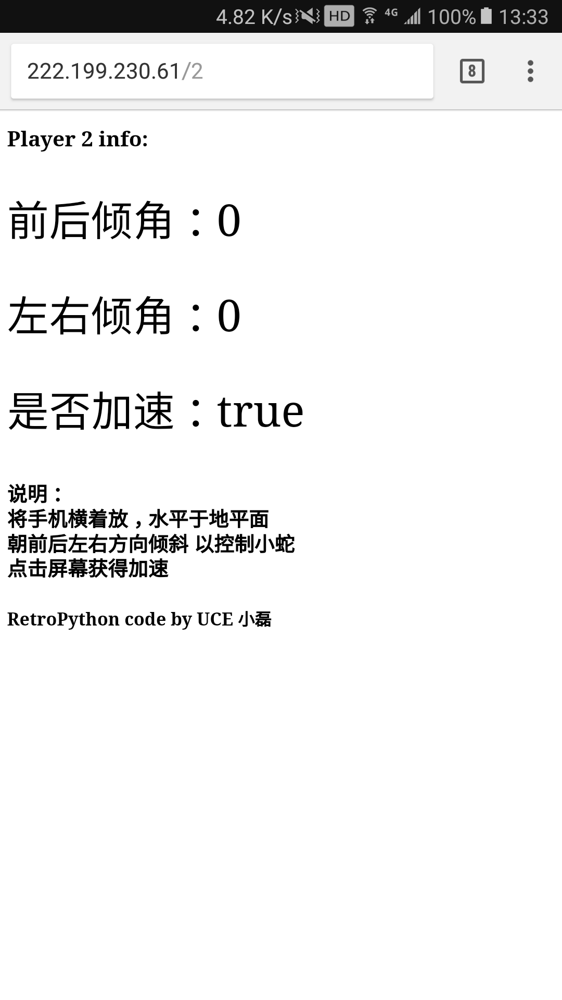

# RetroPython 简要配置说明 v0.10
----
> 作者：`小磊`

> 邮箱：`ylxx@live.com`

> 时间：`2016-09-26`

### RetroPython

  基于 JavaScript, canvas, socket.io, Flask 构建

  两人用各自手机作为重力感应手柄 来操控贪吃蛇进行对战的游戏

## 一. 环境

### 1. 电脑

Python版本：`Python 2.7`

Python库：`flask`  `flask_socketio`(安装：`pip install flask flask_socketio` )

浏览器：推荐`Chrome`

### 2. 手机端

手机版 Chrome：**一定要最新版！**

## 二. 使用方法：

`cd ./flask`

`python socket.io.py` (注意:默认是80端口，`Linux`下请使用`sudo`)

使两台作为控制器的手机与电脑处于同一局域网

电脑的Chrome打开`[电脑局域网IP]/canvas`  例如：`192.168.1.101/canvas`

便可见到两条贪吃蛇 ，如图

玩家一用手机Chrome打开`[电脑局域网IP]/1`

玩家二用手机Chrome打开`[电脑局域网IP]/2`

玩家手机屏幕应如图显示(建议关闭自适应屏幕)

**享受对战吧！**

## 三. 注意事项

1. 手机版 Chrome **一定要最新版！**
2. 由于使用了相对路径,一定要在`./flask`下运行Python,否则找不到文件
3. 注意80端口是否被占用，或是否有权限使用
4. 建议关闭手机自适应屏幕
